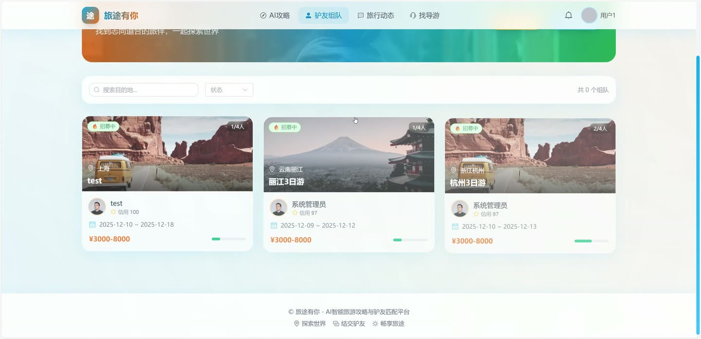
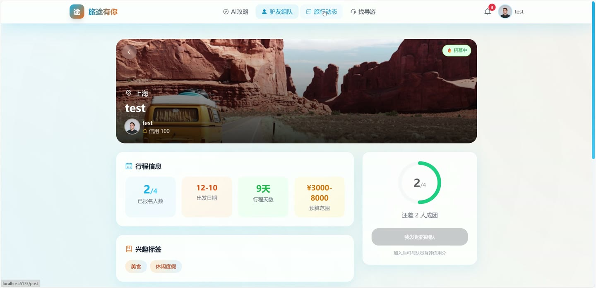

# (附文档)Springboot3+Vue3+MySQL AI智能旅游攻略与驴友匹配平台

**技术栈**：Springboot3、Vue3、MySQL

### 系统简介

本系统是一个基于 Spring Boot 3 + Vue 3 + MySQL 的 AI 智能旅游攻略与驴友匹配平台，采用前后端分离架构。系统包含普通用户、导游、管理员三种角色，提供 AI 智能生成旅游攻略、驴友组队与精准匹配、导游认证与评价、社交动态发布与互动、目的地探索等功能。
 
### 核心功能
 
### 用户端

 
- AI 智能生成攻略：输入目的地、天数、预算和兴趣偏好，调用百度千帆 AI 接口自动生成包含每日行程安排（上午/下午/晚间）和旅行提示的结构化攻略 
- 驴友组队与精准匹配：浏览招募中的组队信息（支持按目的地/状态筛选），系统根据用户兴趣、同城、性别、年龄、发起人信用分等维度计算匹配分数并排序推荐 
- 组队申请与审批：用户可申请加入组队并附言，发起人可查看申请人列表并通过/拒绝申请，通过后自动增加队伍当前人数 
- 我发起的/加入的组队：查看自己创建的组队列表及每个队伍的成员信息，查看已成功加入的组队记录 
- 我的攻略收藏：查看已收藏的旅游攻略列表，支持取消收藏操作 
- 社交动态发布：发布图文/视频动态（支持单张/批量上传图片及视频），包含位置信息和关联攻略，自动统计浏览/点赞/评论数 
- 动态互动：对动态和攻略进行点赞/取消点赞，发表评论（支持回复评论），评论后自动通知内容作者 
- 用户关注：关注/取消关注其他用户，查看关注列表和粉丝列表，关注后自动发送通知 
- 消息中心：接收系统通知（点赞、评论、关注、组队申请/通过），查看未读消息数，支持单条或全部标记已读 
- 个人资料管理：编辑昵称、头像、手机、邮箱、性别、生日、城市、个人简介、兴趣标签等信息 
- 导游申请与认证：提交导游认证申请（填写真实姓名、身份证、导游证、服务区域、语言、专长、价格、介绍等），管理员审核后成为认证导游 
- 导游推荐：根据用户兴趣标签和目的地推荐认证导游，按评分和匹配度排序 
- 导游评价：对服务过的导游进行评分（1-5 星）和文字评价，系统自动更新导游平均评分 
- 用户互评：组队结束后对队友进行评分，评分影响用户的信用分（好评 +2，差评 -3） 
- 目的地探索：查看热门目的地列表（按热度排序），支持按名称/省份关键词搜索，查看目的地详情（最佳季节、预算、位置等） 
- 个人信用分：系统根据用户评价自动调整信用分，信用分影响组队匹配推荐权重
 
### 导游端

 
- 导游资料管理：查看和编辑自己的导游认证信息（服务区域、语言、专长、价格、介绍、照片等） 
- 查看评价：查看用户对自己的评分和评价列表，评分自动汇总展示 
- 服务状态：管理员审核通过后导游状态变为已认证，可在前台被用户搜索和推荐
 
### 管理员端

 
- 数据统计面板：查看平台用户数、攻略数、动态数、组队数的总览统计 
- 用户管理：新增/编辑用户，修改用户角色（普通用户/导游/管理员）和状态（正常/禁用），调整用户信用分，删除用户 
- 动态管理：新增/编辑/删除用户发布的动态内容 
- 攻略管理：新增/编辑/删除旅游攻略 
- 组队管理：新增/编辑/删除组队信息 
- 导游审核：查看待审核的导游认证申请，通过或拒绝认证，管理已认证导游信息 
- 系统配置管理：管理百度 AI API Key 等系统配置项（键值对形式） 
- 目的地管理：新增/编辑/删除目的地信息（名称、国家、省份、城市、封面、描述、最佳季节、预算、热度等）
 
### 技术栈

 后端框架Spring Boot 3.0 ORMMyBatis-Plus 3.5 权限认证JWT Token（自定义 JwtUtil） 密码加密BCrypt（Hutool 工具库） 前端框架Vue 3 状态管理Pinia 构建工具Vite 数据库MySQL 8.0 AI 接口百度千帆 V2（兼容 OpenAI 协议，模型 ernie-speed-128k） HTTP 客户端OkHttp 3 JSON 处理FastJSON 2 文件上传本地文件存储（按日期分目录）
 
### 交付内容

 
- 后端完整源码 
- 前端完整源码 
- 数据库初始化脚本 
- 万字文档

## 界面展示

---

## 获取完整源码 + 万字文档

本仓库为项目介绍页。**完整前后端源码、数据库初始化脚本、万字项目文档**，请加微信 `kangkangcode`，或访问 [codekk.top](http://codekk.top) 获取。

可作课程设计 / 毕业设计参考，支持远程部署调试。